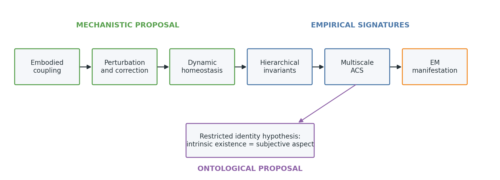
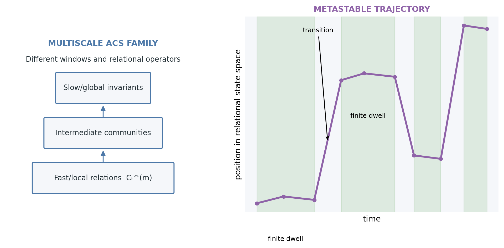
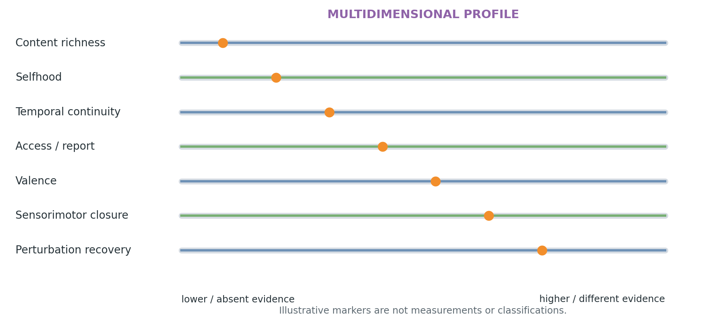
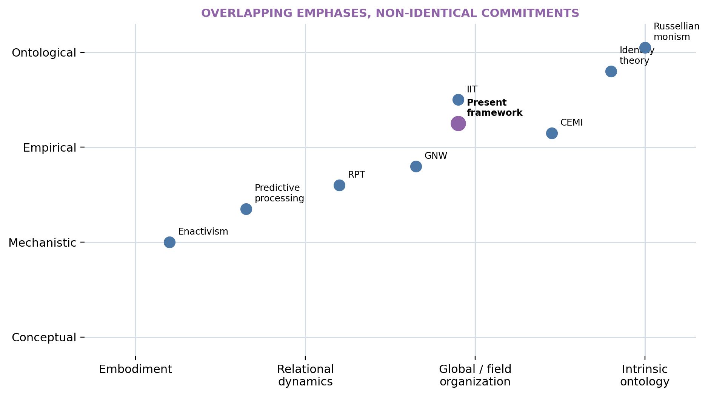
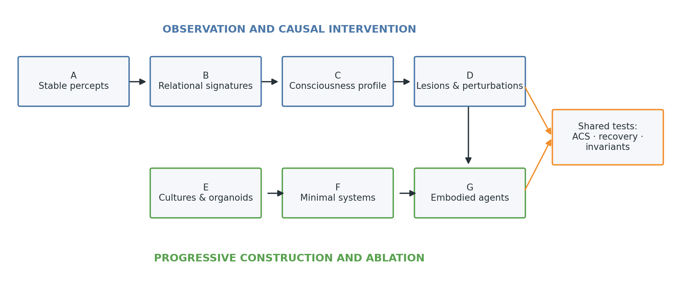

# Introduction

Consciousness research faces a coordination problem as much as an explanatory one. Neuroscience can relate reports and behavioural responsiveness to recurrent processing, widespread access, neural complexity, and changing patterns of integration. Embodied and enactive approaches explain perception and cognition through organism–environment coupling. Dynamical systems theory describes transient coordination and metastability. Philosophy asks why any of these public processes should have a subjective aspect. These lines of work constrain one another, yet they are often presented as competing complete explanations or as enquiries that can proceed independently.

This paper develops a narrower synthesis. An embodied cognitive system must continually maintain workable relations among its sensory states, actions, internal activity, bodily needs, and environment. Maintenance here is not passive constancy. It is a temporally extended process of correction, exploration, compensation, and reorganization under perturbation. Patterns that remain useful across repeated transformations become increasingly invariant. Their organization is not exhausted by the activity of individual units; it also depends on relations among units and on how those relations persist and change across timescales. The paper calls these evolving relational patterns **activation-correlation structures (ACS)**.

In nervous systems, ACS are implemented by physical neural activity. Ionic currents necessarily have electromagnetic (EM) consequences, and measurements such as local field potentials, EEG, and MEG sample projections of coordinated electrical dynamics [@nunez2006]. The present framework does not extract the field from its generators and assign it an independent power to produce consciousness. It treats coherent EM organization as the most directly measurable macroscopic manifestation of coordinated electrical dynamics, while leaving open whether field-level variables have causal roles not captured by current neural measurements.

The most speculative step is ontological. The framework hypothesizes that the intrinsic existence of a qualifying, self-stabilizing physical organization is its subjective aspect. A nervous system does not build a miniature picture for a further observer. It maintains an organism-centred physical world of relations. On the identity proposal, the subject and the experienced world are aspects of the ongoing existence of that organized process. This move belongs near identity theory and Russellian-monist families rather than constituting a novel metaphysical proof [@smart1959; @strawson2006; @chalmers2013]. Its possible contribution is a restricted mechanistic route to the kind of organization that might qualify.

The resulting chain is:

> embodied coupling → perturbation and correction → dynamic homeostasis → metastable stabilization → hierarchical invariants → multiscale ACS → measurable EM organization → a restricted empirical correlate hypothesis → an ontological identity proposal.

Every arrow before the last two is intended to become a mechanistic or empirical research question. The final identity is a philosophical hypothesis. Confirmation of an ACS marker would not, by itself, establish the identity claim. Conversely, disagreement with the ontology need not invalidate the mechanistic programme.

{width=95%}

# Scope, claims, and epistemic levels

The framework makes three kinds of claim that must be evaluated separately.

1. **Mechanistic proposal.** Cognition can be modelled as active stabilization of viable organism–environment relations. Self-generated and external perturbations provide variation; dynamic homeostasis prevents silence, saturation, rigidity, and uncontrolled activity; repeated stabilization produces invariants. Prediction-error or free-energy minimization may implement parts of this process, but no unique objective function is assumed.

2. **Empirical hypothesis.** Some regularities associated with stable percepts and global conscious organization are better captured by multiscale relational trajectories than by isolated activity values. ACS measures should therefore add out-of-sample predictive value, show structured changes under perturbation, and generalize where specified in Section 12. This is testable even if ACS is eventually replaced by a better relational construct.

3. **Ontological proposal.** A qualifying self-stabilizing physical organization is identical with, rather than a cause of, subjective existence. This does not follow from the empirical hypotheses. It is constrained by them only insofar as a defensible identity requires a principled account of what organization is being identified.

The paper is a conceptual foundation, not a report of new experimental results. It does not present a unique mathematical definition of consciousness, a consciousness score, or a classification of present animals, organoids, or artificial systems. It uses *internal physical world* for a causally active, physically instantiated organization of organism-relevant relations, and *ontological realization* for the proposal that the organization’s intrinsic existence is the subjective aspect. Neither term denotes a hidden observer or an extra substance.

# Cognition as self-stabilizing embodied dynamics

## Perception as stabilization

Passive-encoding metaphors begin with an input, transform it, and end with a representation. Embodied systems do not begin or end at those boundaries. Their movements alter the next sensory sample; posture, attention, autonomic state, and prior activity alter what can be sampled; and the environment responds on its own timescale. Perception is therefore better approached as the maintenance of a determinate but revisable organization within a closed causal process. Sensorimotor and enactive theories make related claims: perceptual capacities depend on structured relations between possible actions and sensory consequences, and cognition is a form of situated sense-making [@oregan2001; @noe2004; @varela1991; @thompson2007].

*Stabilization* does not mean that activity becomes constant or that the system discovers a final equilibrium. It means that selected relations remain within a functional regime despite disturbances. A perceived cup can remain the same usable object while retinal input changes with saccades, lighting, occlusion, and grasping. The stable item is not a pixel array but a structured set of relations that supports discrimination and action. The account is compatible with determinate perceptual organization without positing an internal spectator: reciprocal constraints among current input, memory, recurrent state, body, and expected consequences can settle into one of several context-sensitive organizations.

Four sources of perturbation matter. **Environmental perturbations** include motion, noise, occlusion, and other agents. **Bodily perturbations** include changing posture, fatigue, pain, arousal, and internal physiology. **Action-generated perturbations** include the sensory consequences of looking, reaching, speaking, or withdrawing. **Endogenous perturbations** include spontaneous activity, memory intrusion, exploratory variability, and changes in attention. A cognitive architecture that remained useful only under one fixed input would not be stable in the relevant sense.

Stabilization relates perception, prediction, control, action, and correction without making them synonyms. Perception is the current organization of relevant relations. Prediction estimates how those relations may evolve, especially where delays make purely reactive control inadequate. Control selects interventions that keep variables or relations within viable regimes. Action changes the coupled system. Correction uses the resulting discrepancy or loss of viability to revise activity and future action. Predictive processing and active inference offer influential formalisms for parts of this loop [@clark2013; @friston2010]. The present framework treats error or free-energy minimization as possible implementations of stabilization, not as its sole definition.

## Action and sensorimotor closure

Closed perception–action loops are developmentally and organizationally central because they provide interventions. Through action, a system can learn which sensory regularities covary with its own movements, which remain independent, and which actions restore a viable relation. This turns observation into causal sampling. A reaching error can be corrected, an occluded object can be viewed from another angle, and an aversive internal state can motivate withdrawal or regulation.

The claim is not that overt action is required at every moment of experience. Dreaming, imagery, paralysis, and temporary sensory disconnection make that stronger claim implausible. The more defensible claim is that the architecture capable of maintaining such episodes was formed and is ordinarily maintained through embodied coupling. Once established, recurrent activity, memory, and predictive organization can temporarily sustain an internal physical world without current overt movement. Even during paralysis, internal bodily regulation and neural activity continue; nevertheless, these facts should not be used to define away counterexamples. The developmental claim must be tested against cases of congenital motor limitation and unusual sensory histories.

Closure is also graded. A thermostat has a closed loop, but its variables, timescales, repertoire, and learned organization are extremely limited. Sensorimotor closure is therefore neither sufficient for cognition nor a shortcut to consciousness. Its proposed role is to ground relations and permit action-dependent stabilization.

## Perturbation, self-perturbation, and metastability

An adaptive system needs variation as well as stability. Too little perturbation can produce rigidity or habituation; too little stabilization can produce noise, chaotic wandering, or loss of functional identity. This tension motivates a **self-perturbation–stabilization** principle: endogenous variation supplies candidate states and actions, while selection and regulation preserve organizations that remain viable and informative. Randomness alone is not exploration, and persistence alone is not cognition. The relevant regime combines bounded novelty with recoverability.

Metastability provides an appropriate dynamical vocabulary. A metastable state has a finite dwell time: it is stable enough to coordinate a perception, intention, or action, yet remains capable of transition. Coordination dynamics uses metastability to describe coexistence between tendencies toward integration and independent activity [@kelso1995]. Neural models and recordings also motivate transient-state descriptions rather than a succession of permanent attractors [@rabinovich2008; @deco2017]. The framework therefore expects multiple compatible organizations, context-sensitive dwell times, and continuous adjustment rather than convergence to a single optimum.

Perturbation is not merely an experimental nuisance. It is a way to identify the causal organization of a system. Two systems may show the same unperturbed activity yet differ in how they deform, recover, or reorganize. Recovery time, transition path, and preservation of task-relevant relations can therefore be more informative than a static snapshot. The experimental programme uses external perturbations, lesions, reversible inhibition, and closed-loop intervention for this reason.

## Dynamic homeostasis

Static constancy would be a poor objective for a nervous system. Permanent high activity would saturate response ranges and obscure differences; permanent depression or silence would remove functional differentiation. Perfectly fixed correlations could preserve structure only by eliminating sensitivity to new information. **Dynamic homeostasis** instead means maintaining neural, bodily, and relational variables within functional regimes while preserving enough variability to encode, explore, learn, and reorganize.

At a minimal level, suppose a regulated variable (z_i(t)) has a viable interval rather than a single set point:

$$
z_i(t) \in [z_i^{-},z_i^{+}]
$$

for most of an interval relevant to the system. Regulation may minimize excursions outside the interval while also preserving response variance, for example through a provisional objective

$$
J = -\sum_i w_i\,\ell\!\left(z_i;z_i^{-},z_i^{+}\right)
    + \lambda_V V(x)
    + \lambda_R R(x),
$$

where (ell) penalizes non-viable excursions, (V(x)) rewards informative variation, and (R(x)) rewards recoverability after perturbation. This is not offered as a neural law. It makes explicit why stabilization cannot be reduced to minimizing variance or freezing activity.

Known biology supplies related but non-equivalent mechanisms. Homeostatic synaptic plasticity can counter destabilizing changes in neural activity across local and network scales [@turrigiano2012]. Excitation–inhibition regulation, intrinsic excitability, synaptic scaling, neuromodulation, and plasticity can contribute on different timescales. Allostasis emphasizes anticipatory regulation rather than reaction after deviation, while interoceptive systems link large-scale brain organization to regulation of the body [@kleckner2017; @tschantz2022]. The framework draws on these phenomena but does not claim that dynamic homeostasis is identical to any one of them.

Local adaptation and global regulation must coexist. If every unit independently fixes its mean activity, population-level organization may be lost; if only a global variable is controlled, local populations may saturate or fall silent. A useful architecture should preserve relative differences and task-relevant structure while maintaining bounded activity, adequate entropy, and the capacity for future change. This creates experimentally separable failure modes: saturation, silence, rigid low-entropy repetition, unstable high-entropy activity, or loss of recoverability.

## Hierarchical abstraction through invariant pickup

The central learning proposal can be expressed as a sequence. First, fast local patterns stabilize over short intervals. Second, regularities that recur across noise, viewpoint, action, and context survive repeated perturbations. Third, other processes become selectively sensitive to what remains stable across those lower-level changes. Fourth, slower or more encompassing dynamics maintain increasingly invariant relations. Fifth, an abstraction becomes a history of successful stabilization across a family of transformations.

This hierarchy can be formalized provisionally by layer- or scale-indexed state (h_t^{(ell)}), characteristic time (	au_ell), and perturbation radius (r_ell):

$$
h_{t+1}^{(\ell)} = F^{(\ell)}\!\left(h_t^{(\ell)},h_t^{(\ell-1)},h_t^{(\ell+1)},a_t,\xi_t\right),
$$

$$
\tau_1 < \tau_2 < \cdots < \tau_L,
\qquad
r_1 < r_2 < \cdots < r_L.
$$

The inequalities are hypotheses to test, not anatomical laws. A hierarchy can arise through spatial scale, temporal scale, recurrent depth, causal organization, or their combination. Higher invariance need not reside in a physically deeper cortical layer, and slower is not always more abstract.

Examples illustrate the intended progression. Edge-like regularities survive small local changes; object organizations survive viewpoint and partial occlusion; places survive changing paths and lighting; affordances survive variations in the motor route that realizes them; other agents remain identifiable across motion and expression; social situations preserve roles across different participants; self-models integrate interoception, action history, memory, and social feedback; abstract concepts preserve relational structure across superficially different instances. Representational similarity analysis provides one family of methods for testing whether relational geometry is preserved across such transformations [@nili2014].

Prediction becomes necessary when stabilization occurs across delayed loops. Sensory, neural, and motor delays mean that a correction based only on the present sample can arrive too late. The companion mechanistic theory therefore proposes that reliable prediction may emerge as **delayed stabilization**: maintaining a future viable relation requires anticipating the consequences of action and environmental change. This does not deny predictive coding. It makes a specific empirical ordering claim: robust prediction should depend on representations already stable under task-irrelevant perturbations, and directly optimized prediction is not the only route by which anticipatory dynamics may develop.

## Internal physical worlds

The nervous system does not construct a small inner picture. It maintains a physically instantiated organization of relations: among sensory regularities, possible actions, body state, remembered events, expected outcomes, values, and other agents. Calling this an **internal physical world** emphasizes six properties.

First, it is physical: it is realized in ongoing neural, bodily, and field dynamics, not in an abstract description floating free of implementation. Second, it is causally active: its current organization constrains attention, action, memory, and autonomic regulation. Third, it is externally constrained: successful stabilization depends on regularities that survive contact with an environment not created by the organism. Fourth, it is partly autonomous: recurrence, memory, and prediction permit imagery, planning, dreaming, and error. Fifth, it spans timescales, from transient sensory organization to persistent self and world models. Sixth, it is centred on the organism’s body, possible actions, and viability.

“World” here denotes structured relational scope, not veridical completeness. Illusions and hallucinations remain internal physical organizations, but their relations are less directly constrained by current external causes. A photograph or database also contains world-related structure, but need not maintain it through self-stabilizing causal dynamics. The construct therefore combines content, dynamics, embodiment, and maintenance rather than treating representational resemblance as sufficient.

The decisive anti-homuncular statement is:

> The conscious subject is not an additional entity observing the internal world. The proposal is that the subject and experienced world are aspects of the ongoing existence of that organized physical process.

This is the paper’s identity hypothesis, not an empirical conclusion smuggled into the mechanistic description. A reader may accept internal physical worlds as a useful model of cognition while rejecting their proposed identity with experience.

# Activation-correlation structures

## Motivation and role

Neural state is often summarized by firing rates, amplitudes, spectral power, or localized activation. These quantities are indispensable, but many cognitive properties concern relations: which populations coordinate, with what lag and direction, in which frequency ranges, for how long, and how the arrangement reconfigures. Dynamic functional-connectivity research illustrates both the promise and the methodological hazards of treating time-varying relations as scientific objects [@hutchison2013]. ACS generalizes that intuition across measurement modalities and scales.

An ACS is a time-evolving, multiscale relational structure implemented by physical activity. It may include pairwise and lagged correlations, phase synchrony, directed dependencies, recurrence, higher-order interactions, community structure, integration and segregation, cross-frequency relations, persistence, and transition structure. It is intended as a mesoscopic bridge: microscopic events implement population activity; population relations form measurable structures; structures constrain metastable cognitive states and behaviour; their electrical implementation produces measurable EM manifestations.

ACS does not make neurons or absolute activity unimportant. A correlation pattern cannot exist without variables that vary, and identical normalized correlations may accompany very different energy, excitability, or causal regimes. The empirical question is whether relational organization adds explanatory value beyond those variables.

## Minimal multiscale formalism

Let the state of (n) measured neural or physical populations be

$$
x(t) \in \mathbb{R}^{n}.
$$

For observation window (	au) and relational measure (m), define

$$
C_{\tau}^{(m)}(t)
=
\mathcal{R}^{(m)}
\left(
x(t') : t' \in [t-\tau,t]
\right).
$$

(mathcal{R}^{(m)}) may estimate correlation, lagged mutual information, phase coupling, transfer entropy, recurrence, a directed graphical relation, or a higher-order interaction. The multiscale ACS is the indexed family

$$
\mathcal{A}(t)
=
\left\{
C_{\tau}^{(m)}(t)
\right\}_{\tau \in T,\,m \in M}.
$$

This definition separates the research construct (mathcal{A}) from any estimator. A Pearson correlation matrix at one window width is an initial operationalization, not the ACS itself. Different modalities impose different sampling rates, spatial mixing, noise models, and causal limitations. EEG phase relations, calcium-imaging recurrence, spiking transfer entropy, and fMRI connectivity cannot be treated as interchangeable observations of a single exact object.

## ACS space and metastable trajectories

To say that cognition evolves in ACS space is a modelling claim: some cognitive regularities may be captured more naturally by trajectories through relational organization than by trajectories of isolated activations. An ACS trajectory can visit regions associated with a stable percept, action policy, bodily state, or disconnected dream episode. Context may shift the absolute activity while preserving part of the relational geometry.

A metastable episode can be described by relatively slow structural deformation:

$$
D\!\left(\mathcal{A}(t+\Delta t),\mathcal{A}(t)\right) < \varepsilon
$$

for a finite dwell interval. (D) might compare weighted graphs, representational dissimilarity matrices, simplicial structures, recurrence plots, or learned embeddings. A transition involves a transient increase in structural change, not necessarily a total loss of organization. Dwell-time distributions, transition probabilities, and recovery trajectories matter as much as average stability.

{width=92%}

## Candidate dimensions and limitations

No consciousness score is proposed. Instead, an ACS profile may include coherence, differentiation, integration, modularity, recurrence, hierarchical depth, multiscale persistence, transition richness, controllability, sensorimotor closure, robustness under perturbation, and adaptability after perturbation. These dimensions can conflict: high coherence may reduce differentiation; strong persistence may become rigidity; rich transitions may become instability. The expected regime is a structured profile, not maximization of every axis.

Several limitations follow. Relations depend on variable selection and scale. Common drivers and volume conduction can create spurious correlation. Sliding windows impose bias and temporal resolution. Directed measures require assumptions that may not hold. Higher-order estimators demand large samples. A learned ACS embedding may predict well while remaining difficult to interpret. Analyses must therefore include surrogate data, estimator sensitivity, preregistered windows where possible, nested cross-validation, measurement-error models, and baselines that contain raw activity, spectrum, anatomy, and conventional connectivity. ACS earns a role only through reproducible incremental value.

# Electromagnetic manifestation of organized dynamics

Neural signalling involves ionic currents. Coordinated electrical activity therefore has electromagnetic consequences, and EEG, MEG, electrocorticography, and local field potentials provide different projections of source organization [@nunez2006]. This physical continuity motivates a modest claim:

> Coherent electromagnetic organization is the most directly measurable macroscopic manifestation of coordinated electrical dynamics, not necessarily an independently causal or sufficient substrate of consciousness.

The claim differs from theories that identify a global EM field as the integrative seat of consciousness or assign it a distinctive causal role [@pockett2000; @mcfadden2020]. Here, the relevant candidate is the complete organized physical process: cellular currents, synaptic and population dynamics, bodily and environmental coupling, and their field manifestations. Abstracting the field from its generators may discard causal organization just as abstracting a correlation matrix from its signals can.

The difference is empirical where perturbation permits mediation analysis. An external EM intervention will ordinarily change neural activity; it is therefore incoherent to demand a manipulation that changes the field while leaving the generating ACS literally unchanged. The relevant questions are whether changes in conscious content or level are statistically mediated by measurable changes in neural ACS, and whether field-level variables explain reproducible residual effects after sufficiently sensitive neural measurement. A residual would favour an independent field-level causal contribution, although unmeasured neural change would remain an alternative. Full mediation would support the manifestation view but would not prove metaphysical identity.

# Consciousness as ontological realization

The mechanistic sections describe how an internal physical world could be maintained. The empirical sections ask which relational signatures accompany perceptual stability and consciousness level. Neither answers why there is something it is like for the system. The ontological proposal begins by refusing a production metaphor: a qualifying physical organization does not first exist non-experientially and then create a second object called experience. Its intrinsic existence is hypothesized to be the subjective aspect.

*Intrinsic existence* means the organization as it exists and acts, not merely as represented by an external model. *Ontological realization* means identity between that existence and subjectivity, not causal generation across an unexplained gap. This resembles mind–brain identity theory [@smart1959] and sits near Russellian-monist views that distinguish structural descriptions of physics from the intrinsic nature of what realizes them [@strawson2006; @chalmers2013]. The paper does not claim novelty for that move.

The proposed restriction is mechanistic. Not every correlation, controller, oscillator, or field is assumed to qualify. Candidate organization includes self-stabilizing causal closure across internal and embodied variables, dynamic homeostasis, differentiation with integration, multiscale recurrence, counterfactual robustness, and an internally maintained world centred on the system’s own viability. These features are offered as a research profile, not necessary and sufficient conditions.

This restriction avoids indiscriminate attribution but creates a **qualification problem**: why should these organizations, and not simpler or differently organized ones, have an intrinsic aspect? It also leaves boundary and unity problems. If an ACS decomposes into modules, why is there one subject rather than many? If two systems couple, when do they form one organization? The framework cannot claim that the combination problem is solved “by construction”; it replaces a universal combination problem with a restricted but still difficult individuation problem.

# Qualia, language games, and the long spectrum

## Language-game thesis

Ordinary and scientific language uses contrasts such as conscious/unconscious, experience/no experience, red/not red, pain/no pain, and self/non-self. Such predicates coordinate reports, diagnosis, action, and social expectations. Following the language-game insight that a term’s role depends on practices of use [@wittgenstein1953], their practical sharpness need not reveal sharp natural boundaries.

Language can impose binary predicates on processes that are continuous, multidimensional, hysteretic, or organized by family resemblance. Clinical categories may be discrete because decisions must be made, even when underlying physiology changes gradually. Colour names divide a structured perceptual space for communication. “Conscious” may sometimes mean reportable, responsive, awake, remembered, or morally considerable. These uses should not be conflated.

Linguistic analysis does not establish phenomenal continuity. The independent argument is mechanistic: candidate dimensions such as differentiation, recurrence, sensorimotor closure, temporal persistence, and self-modelling can vary separately and gradually. If experience is identical with qualifying organization, then changes in organization motivate—but do not logically guarantee—a graded and multidimensional phenomenology.

## A multidimensional long spectrum

A single ladder from “less” to “more” consciousness is premature. Philosophical and comparative work has argued for separating level from content and for multidimensional animal-consciousness profiles [@bayne2016; @birch2020]. The present framework distinguishes at least: presence or global level, richness of content, selfhood, temporal continuity, reportability, cognitive access, valence, and moral relevance. None is assumed to determine all the others.

The empirical domain forms a long spectrum: ordinary waking states; attention and inattention; dreaming; sedation and anaesthesia; seizures and disorders of consciousness; infants and developing organisms; non-human animals and simple nervous systems; neural cultures and organoids; future embodied artificial systems; and hypothetical minimal physical organizations. Listing these cases is not an assertion that all are conscious. It replaces an immediate yes/no verdict with questions about what kind of internal physical world, if any, is maintained; on which timescales; with what stability, differentiation, bodily relevance, and capacity for perturbation recovery.

{width=92%}

Moral relevance cannot be read directly from an ACS profile. Evidence of valenced states, welfare interests, learning, and vulnerability may warrant precaution even when metaphysical certainty is unavailable. Conversely, reportability may be high in a language-capable system while evidence for persistent embodied self-maintenance is weak. Scientific measurement and ethical decision therefore require related but distinct standards.

## Structured qualia transitions

Colour provides a tractable illustration. A transition from red through orange to yellow may correspond to a continuous but structured transformation in neural relational geometry. Within a participant, candidate ACS signatures should reproduce across repetitions while changing systematically with stimulus and context. Across participants, common relational structure might be detectable after anatomical or functional alignment even when exact activations differ, as intersubject and representational-alignment methods suggest is possible for some stimulus-driven organization [@hasson2004; @nili2014].

The same logic applies to pitch and timbre gradients, tactile intensity, pain quality, and changing body states. The analysis must separate sensory similarity from labels: categorical language can sharpen boundaries that are weaker in nonverbal discrimination, while learning can also reshape perception. A relational match would be a candidate physical signature or correlate. It would not prove identical qualia across people, and matching one neural pattern would not be sufficient to attribute the same experience to an artificial system.

# Mapping the hard problem onto ontology

The hard problem asks why physical processing is accompanied by experience [@chalmers1996]. The identity proposal changes the grammar of the question. If a qualifying organized physical world and its subjective existence are one process under different modes of description, the organization does not *produce* experience as a separable effect. Its intrinsic existence is the subjective aspect.

The reasoning is limited but explicit. Physicalist neuroscience ordinarily explains causal functions in structural and relational terms. A completed functional description may still leave the question “why does this feel like anything?” [@nagel1974]. The proposed identity denies that an additional bridge law must generate a second entity. The residual question becomes why organized existence has an intrinsic aspect at all. Asking why qualia exist may then be comparable to asking why spacetime, fields, matter, or existence itself exists.

This relocation does not deductively solve the hard problem. It may be rejected as relabelling, and it supplies no derivation of a particular quality from a particular ACS. It belongs to an existing family of identity and Russellian-monist strategies. Its distinctive wager is that the metaphysical restriction can be disciplined by a mechanistic route from embodied stabilization to an integrated internal physical world. Whether that route justifies the restriction is the qualification problem, not a settled conclusion.

# Particle and field analogies: scope and limits

Modern physics often characterizes persisting entities through organized excitations and relational structures rather than indivisible classical substances. By a deliberately loose analogy, a conscious episode may be treated as a metastable organization within ongoing neural and bodily dynamics. The useful resemblance concerns finite persistence, organization, and transition.

No quantum mechanism is proposed. Neural metastability does not become quantum-field dynamics because both use the word “field,” and a particle analogy does not explain subjectivity. The analogy should be discarded wherever it encourages scale confusion, reification of ACS, or an unsupported appeal to fundamental physics.

# Relation to existing theories

The synthesis overlaps with several mature programmes. The comparison below states shared ground, divergence, a possible separating observation, and the level at which the difference primarily occurs. In many cases the views may be complementary rather than mutually exclusive [@sethbayne2022].

| Theory | Shared ground | Precise divergence | Potential separating evidence | Difference |
|---|---|---|---|---|
| Global Neuronal Workspace (GNW) [@baars1988; @dehaene2001; @mashour2020] | Recurrent, sustained, distributed organization matters for conscious access. | GNW centres on ignition and global availability; this framework also asks how embodied stabilization forms content and advances an identity claim not required by GNW. | ACS features that predict stable experience without workspace-style global access, or ignition that adds value beyond ACS, would constrain the relation. | Mechanistic and conceptual |
| Integrated Information Theory (IIT) [@tononi2016] | Integration and differentiation are both relevant; intrinsic causal organization matters. | ACS is a provisional family of empirical relational descriptions, not $\Phi$, an exclusion postulate, or a consciousness scalar. Embodiment and dynamic homeostasis are central here. | Dissociations between IIT-motivated causal measures and the multidimensional ACS profile across perturbations would separate predictions. | Empirical and ontological |
| Recurrent Processing Theory [@lamme2006] | Recurrent interaction is important for conscious content and cannot be reduced to feed-forward activation. | Recurrence is one ACS dimension; the framework additionally requires multiscale embodied maintenance and makes a restricted identity proposal. | Local recurrence sufficient for content despite absent broader self-stabilizing organization would challenge the stronger mechanistic restriction. | Mechanistic |
| Predictive Processing [@clark2013] | Perception depends on top-down constraints and correction of mismatches. | Prediction is a candidate means of stabilization; it is not assumed to be the primitive or unique objective. | Matched models in which invariance and future-sensitive behaviour emerge from viability-based stabilization without direct prediction loss would favour the broader formulation. | Mechanistic |
| Active Inference [@friston2010] | Perception and action form a closed inferential-control loop; bodily regulation matters. | The present programme seeks operational local dynamics and relational signatures without treating free energy as the only formalization. | Model comparison can test whether free-energy quantities explain outcomes after stabilization and homeostatic variables, or conversely subsume them. | Formal and mechanistic |
| Enactivism and sensorimotor theory [@varela1991; @oregan2001; @noe2004; @thompson2007] | Cognition is constituted through embodied sense-making and sensorimotor coupling. | The paper adds a mesoscopic ACS construct, EM manifestation claim, and explicit physical identity hypothesis. | Temporarily decoupled experience and systems with atypical action histories test how strong the constitutive coupling must be. | Conceptual and mechanistic |
| Coordination dynamics and metastability [@kelso1995; @rabinovich2008; @deco2017] | Cognition involves transient coordination, integration–segregation balance, and flexible transitions. | The framework embeds metastability in a learning and viability account and connects it to ACS and internal physical worlds. | Perturbation-recovery studies can test whether metastability specifically supports invariant stabilization rather than generic flexibility. | Mechanistic and empirical |
| CEMI and other EM-field theories [@pockett2000; @mcfadden2020] | Coordinated neural currents have organized field manifestations that covary with brain function. | The complete generating physical process, not a field abstracted from it, is the candidate organization; independent field sufficiency is not assumed. | Mediation and residual-effect analyses under EM perturbation are directly discriminating, subject to neural measurement sensitivity. | Empirical and ontological |
| Biological naturalism and the “beast machine” view [@searle1992; @seth2021] | Consciousness is a natural biological phenomenon; bodily and interoceptive regulation are important; intelligence alone is insufficient. | The framework is organizationally rather than categorically biological and therefore leaves substrate-independent realization open. | Biological and non-biological systems matched on causal organization would test whether biology contributes beyond organization. | Ontological and empirical |
| Russellian monism [@strawson2006; @chalmers2013] | Structural physical description may omit intrinsic nature; experience may be that intrinsic aspect. | The claim is restricted to a mechanistically characterized class rather than extended to matter generally. | Empirical data cannot decide the ontology alone, but failure to justify a non-arbitrary qualifying class weakens the restriction. | Ontological |
| Mind–brain identity theory [@smart1959] | Experience is not a second substance or product added to brain process. | The present proposal specifies a dynamic, embodied, relational candidate rather than identifying types with local brain states. | Multiple realization and subject-boundary cases test whether the proposed organizational type is coherent. | Ontological and conceptual |

The paper’s novelty claim is deliberately combinatorial. No component is presented as independently new. The contribution sought is a disciplined connection among self-perturbing embodied stabilization, dynamic homeostasis, hierarchical invariants, multiscale ACS, EM manifestation without field-substrate identity, internal physical worlds, a restricted identity claim, and operational predictions.

{width=88%}

# Experimental programme

The programme is organized as seven linked lines. Each line can advance without accepting the ontology. Shared methodological requirements include preregistration where feasible, held-out validation, subject- and dataset-level replication, explicit measurement models, comparison with strong baselines, sensitivity to estimator choice, and publication of negative results.

## Programme A — Stable percepts and transitions

Bistable perception, binocular rivalry, backward masking, near-threshold detection, temporal integration, and confidence judgements provide repeated transitions between perceptual organizations under similar stimulation. Simultaneous EEG/MEG, intracranial recordings where available, eye tracking, and trial-level reports can estimate ACS before, during, and after transitions. Models should compare multiscale ACS features with firing rate or amplitude, spectral power, anatomy, standard static and dynamic connectivity, stimulus properties, eye movements, and behaviour.

The central test is prospective: can relational trajectories predict when a percept stabilizes, how long it dwells, and when it changes on held-out trials and participants? Analyses should separate report preparation from perceptual organization through no-report or delayed-report contrasts where defensible. Failure of ACS to add reproducible predictive value would weaken the central empirical hypothesis.

## Programme B — Qualia-related relational signatures

Parametric colour, pitch, timbre, tactile, pain, and body-state continua can test whether reported similarity corresponds to structured ACS transformations. Designs should collect nonverbal similarity judgements as well as labels, repeat stimuli across contexts, and estimate within-subject reliability before attempting cross-subject alignment. Relational geometry can be compared with raw activation geometry using representational-similarity methods [@nili2014].

The output should be called a candidate organizational correlate or physical signature. Cross-subject convergence would not establish identical experience, and language-specific boundaries must not be mistaken for neural discontinuities.

## Programme C — Consciousness level and profile

Wakefulness, REM and non-REM sleep, graded sedation, anaesthesia, seizures, coma and other disorders of consciousness, meditation, and psychedelic states offer partially overlapping changes in responsiveness, content, and temporal continuity. Dynamic coordination has already differentiated some conscious and unresponsive states [@demertzi2019; @luppi2019], while perturbational complexity can remain informative when behaviour is absent [@casali2013; @sarasso2015].

ACS analyses should not simply reproduce a binary label. They should estimate a profile of persistence, differentiation, recurrence, integration–segregation balance, and transition richness, then relate it to independent indices, retrospective reports, behavioural responsiveness, and clinical outcome. Training on one state contrast and testing on other datasets is essential to avoid an anaesthetic- or acquisition-specific marker.

## Programme D — Lesions and reversible perturbations

Focal damage, disconnection, stimulation, pharmacological manipulation, and reversible inhibition can reveal causal dependencies obscured by intact-system correlation. The target is not a one-region/one-quale map. Studies should measure how perturbation changes multiscale organization, dwell and transition structure, content, global level, recovery, and compensation.

A causal ACS account predicts structured deformation: damage to a hub or recurrent pathway should affect specific profile dimensions and recovery routes. Longitudinal data can distinguish immediate loss, homeostatic compensation, and learned reorganization. Interventions should be chosen with clinical and ethical constraints foremost.

## Programme E — Neural cultures and organoid systems

In vitro preparations allow progressive construction of coupling: spontaneous culture; patterned input; closed-loop stimulation; differentiated sensory-like input layers; embodied robotic coupling; and adaptive homeostatic control. Cortical organoids can develop structured oscillatory activity [@trujillo2019], and cultured neurons have been placed in closed-loop simulated environments [@kagan2022]. These results motivate measurement of dynamics, not claims of consciousness.

At each stage, ask whether the system develops robust metastability, perturbation recovery, hierarchical invariants, action-dependent stabilization, and multiscale ACS. Comparisons require cell-type, maturation, density, stimulation, and open-loop controls. Ethical oversight should increase with functional complexity and uncertainty. Behaviour-like adaptation or oscillation is insufficient to attribute experience.

## Programme F — Minimal physical organization

Excitable chemical media, coupled oscillators, neuromorphic circuits, recurrent analog networks, active matter, and biological collectives can clarify which properties are ubiquitous and which are distinctive. The purpose is contrastive explanation. If nearly every dynamical system has a rich-looking ACS under a flexible enough estimator, the construct lacks specificity.

Matched perturbations should compare closure, recovery, counterfactual sensitivity, hierarchy, controllability, and dependence on self-maintenance variables. Minimal systems can falsify proposed qualification criteria without being prematurely labelled conscious.

## Programme G — Artificial embodied agents

Artificial agents permit controlled ablation. Matched architectures can differ in closed-loop coupling, persistent recurrent state, homeostatic variables, multi-timescale memory, hierarchical invariant learning, and local/global regulation. Environments should vary observation delay, controllability, nuisance transformations, bodily damage or resource variables, and distribution shift.

Outcomes include object permanence, transfer, perturbation robustness, adaptation, self-maintenance, representation geometry, and ACS-like organization. Matched parameter count and compute are necessary baselines. Behavioural performance alone is insufficient to infer consciousness; the programme tests the mechanistic chain.

{width=95%}

# Operationalized predictions

Each prediction specifies a paradigm, independent variable, dependent measure, baseline, comparison, expected direction, disconfirmation criterion, and theory specificity. Confirmation would primarily support the mechanistic or empirical levels, not the identity thesis.

## P1 — ACS adds predictive value

- **Dataset or paradigm:** preregistered near-threshold perception, masking, or binocular-rivalry EEG/MEG and intracranial datasets with trial-level reports.
- **Independent variable:** perceived versus unperceived trials, or stable-percept versus transition periods, conditioned on stimulus and report demands.
- **Dependent measure:** held-out AUC/log loss for report or transition prediction and explained variance in dwell time from multiscale ACS features.
- **Baseline:** amplitude or firing rate, spectral power, anatomy, stimulus variables, eye movements, behaviour, and conventional single-window connectivity.
- **Statistical comparison:** nested cross-validation with participant- and dataset-level random effects; likelihood-ratio or permutation tests for incremental value; correction for the tested ACS families.
- **Expected direction:** ACS models improve out-of-sample prediction and calibration beyond all baselines.
- **Disconfirmation:** no reproducible incremental value across at least two adequately powered datasets or gains vanish under leakage-free validation.
- **Theory specificity:** supports the ACS empirical hypothesis more than generic theories that predict only activation or access; it does not distinguish all relational theories.

## P2 — Cross-subject relational convergence

- **Dataset or paradigm:** repeated naturalistic stimuli and controlled colour/object continua with functional or anatomical alignment.
- **Independent variable:** matched versus mismatched perceptual organization across participants.
- **Dependent measure:** cross-subject identification, representational-geometry correlation, or graph alignment in ACS space versus raw activation space.
- **Baseline:** anatomical alignment, raw multivoxel or sensor activity, spectral features, stimulus-model embeddings, and label-only similarity.
- **Statistical comparison:** held-out-subject decoding and permutation of stimulus identities; hierarchical bootstrap over participants and stimuli.
- **Expected direction:** matched percepts align more strongly and generalize better in relational ACS space.
- **Disconfirmation:** relational features fail to improve reliability or generalization, or improvements are fully explained by stimulus and label structure.
- **Theory specificity:** tests the proposal that invariants are relationally organized; convergence remains a correlate rather than proof of shared qualia.

## P3 — Hierarchical depth tracks invariant cognition

- **Dataset or paradigm:** object, place, affordance, and concept tasks with controlled transformations and delayed sensorimotor contingencies.
- **Independent variable:** transformation radius and temporal horizon required for generalization.
- **Dependent measure:** timescale of ACS persistence, perturbation radius over which relational geometry is retained, and cross-condition decoding.
- **Baseline:** model depth, receptive-field size, raw activity stability, direct supervised prediction accuracy, and static representational similarity.
- **Statistical comparison:** mixed-effects trends across task demands and ablations; mediation of transfer by ACS persistence with prospective replication.
- **Expected direction:** larger transformation radii and longer horizons recruit or learn structures stable across longer timescales and stronger perturbations.
- **Disconfirmation:** invariant performance is consistently explained without increased multiscale persistence or perturbation tolerance.
- **Theory specificity:** directly tests hierarchical invariant formation and the “stable abstraction before prediction” ordering.

## P4 — Dynamic homeostasis supports sustained flexible encoding

- **Dataset or paradigm:** matched recurrent neural or embodied-agent models, with physiological validation where feasible, under prolonged input shifts and perturbations.
- **Independent variable:** adaptive local/global regulation present, ablated, or replaced by fixed normalization.
- **Dependent measure:** saturation and silence rates, effective dimensionality, entropy regime, task information, recovery time, transfer, and post-perturbation adaptability.
- **Baseline:** equal-parameter models with no regulation, fixed gain, standard normalization, and regulation targeting only mean activity.
- **Statistical comparison:** factorial ablation across seeds and environments with survival/time-to-failure analysis and held-out transfer tests.
- **Expected direction:** regulated models spend more time in bounded informative regimes, recover faster, and generalize more robustly without collapsing variability.
- **Disconfirmation:** regulation yields no robust benefit, equivalent baselines perform as well, or the predicted bounded-variability signature does not arise.
- **Theory specificity:** tests dynamic rather than static homeostasis; benefits from any mechanism do not establish consciousness.

## P5 — Consciousness level relates to a multidimensional ACS profile

- **Dataset or paradigm:** wakefulness, REM/NREM sleep, propofol and ketamine conditions, and independent disorders-of-consciousness cohorts.
- **Independent variable:** state and independently assessed consciousness evidence, separated from behavioural responsiveness where possible.
- **Dependent measure:** a preregistered ACS profile spanning persistence, differentiation, recurrence, integration–segregation dynamics, and transition richness.
- **Baseline:** spectral power, static connectivity, anatomy, drug concentration, behavioural responsiveness, and PCI where available.
- **Statistical comparison:** train on one or more state families and test on held-out families/sites; multivariate profile comparison rather than post hoc scalar construction.
- **Expected direction:** independent consciousness evidence covaries with a reproducible configuration of dimensions, while different conscious states can occupy different regions of the profile.
- **Disconfirmation:** the profile fails cross-state/site generalization or merely recovers responsiveness, drug, or acquisition differences.
- **Theory specificity:** supports multiscale organization but may overlap with GNW, IIT, recurrent, and complexity-based theories; discriminating analyses must test their distinct measures.

## P6 — Field effects are mediated by organized neural dynamics

- **Dataset or paradigm:** sham-controlled TMS, tACS, or other ethically accepted EM perturbation combined with high-density EEG/MEG and content/level measures.
- **Independent variable:** perturbation waveform, location, phase, and intensity.
- **Dependent measure:** content or confidence change; neural ACS change; field-model variables; direct, indirect, and residual effects.
- **Baseline:** sham, active-control site/frequency, sensory side-effect ratings, source-level activity/power, and conventional connectivity.
- **Statistical comparison:** preregistered multilevel causal-mediation models with measurement-error sensitivity and negative-control outcomes.
- **Expected direction:** effects on content are mediated by measurable ACS changes; field variables add no stable residual prediction once sufficiently sensitive neural organization is included.
- **Disconfirmation:** reproducible field-level residual effects survive measurement improvement, controls, and replication, or content changes systematically occur without detected ACS mediation.
- **Theory specificity:** residual effects would favour independent causal-field theories over the manifestation view; full mediation would not establish that fields are irrelevant at all descriptive scales.

## P7 — Embodied stabilization precedes broad task optimization

- **Dataset or paradigm:** delayed-control embodied agents trained across nuisance transformations and distribution shifts.
- **Independent variable:** closed-loop self-stabilization with persistent state and viability variables versus matched feed-forward, open-loop, and reward-optimized controls.
- **Dependent measure:** training time at which transferable invariant geometry, perturbation recovery, and object permanence emerge relative to peak benchmark performance.
- **Baseline:** equal parameters, environment interactions, compute, augmentation, and optimized task reward.
- **Statistical comparison:** time-resolved mixed-effects analysis across seeds/tasks and preregistered change-point ordering.
- **Expected direction:** self-stabilizing agents acquire transferable invariant organization and robust recovery before maximal benchmark score, with a stronger ordering than controls.
- **Disconfirmation:** no reproducible ordering or transfer advantage, or it disappears under matched optimization and data exposure.
- **Theory specificity:** tests the developmental ordering implied by embodied stabilization; it bears no direct inference about artificial consciousness.

# Artificial intelligence and PRAttention

Current language models display complex learned representations and internal dynamics. Most deployed systems, however, lack persistent sensorimotor closure, organism-like viability regulation, and a continuously self-maintained internal physical world. Behavioural sophistication is therefore insufficient, under this framework, to infer consciousness. The framework also does not prove that current AI is unconscious: its qualification criteria are provisional, and architecture-level evidence cannot settle an identity claim.

Future tests should examine persistent recurrent state, environmental coupling, sensorimotor closure, self-maintenance variables, dynamic homeostasis, multi-timescale memory, hierarchical invariant pickup, endogenous goals constrained by viability, and perturbation-sensitive ACS monitoring. These are design and measurement principles, not a recipe guaranteed to produce experience.

Standard attention performs context-dependent binding among token representations [@vaswani2017]. Retrieval-augmented systems add selected external information [@lewis2020]. **PRAttention**, developed in companion engineering work, proposes explicit reference handles and progressive retrieval into persistent referential structures. This may extend effective context and approximate one component of hierarchical world maintenance: an agent can preserve a reference, expand it when needed, and revisit an externalized structure. PRAttention by itself lacks the full embodied, homeostatic, recurrent organization described here. It is an engineering bridge, not a theory or implementation of consciousness.

# Objections, alternatives, and limitations

## Redescription objection

**Objection.** “Stabilization” and “ACS” merely rename control and connectivity without adding mechanism. **Response.** The framework is useful only if its ordering claims, perturbation profiles, and incremental predictions outperform existing descriptions. P1, P3, P4, and P7 are designed accordingly. **Open problem.** The companion mechanistic paper must specify local learning and regulatory rules rather than rely on verbal unification.

## Boundary and qualification objection

**Objection.** The features of a qualifying organization are chosen to fit familiar conscious systems. **Response.** The paper presents a multidimensional candidate profile and minimal-system contrasts, not a definition by stipulation. **Open problem.** Necessary, sufficient, or probabilistic qualification criteria remain unavailable; this is the central philosophical weakness.

## Sufficiency versus correlation

**Objection.** Even perfect ACS prediction would show correlation, not sufficiency or identity. **Response.** Agreed. Perturbations can strengthen causal inference about mechanism, but the ontology requires independent argument. **Open problem.** Establish whether interventions on relational organization produce the predicted content and level changes without circularly selecting features from reports.

## Observer-relative scale and variable selection

**Objection.** ACS depends on parcellation, window, estimator, and the observer’s description. **Response.** Robustness across reasonable transformations, modalities, and scales is a required criterion. Causal and predictive invariance can reduce arbitrariness. **Open problem.** Define equivalence classes of ACS descriptions and limits on admissible coarse-graining.

## Multiple realizability and biological specificity

**Objection.** Either the view wrongly excludes non-biological realizations or makes biology irrelevant. **Response.** It remains open whether non-biological systems can reproduce the relevant causal organization. Biological material may contribute mechanisms not captured by coarse computational equivalence. **Open problem.** Develop matched biological, neuromorphic, and simulated comparisons without presuming substrate neutrality.

## Dreaming and paralysis

**Objection.** Conscious episodes occur without overt perception–action closure. **Response.** The core claim is developmental and organizational, not that each episode requires action. Recurrent architecture can maintain a temporarily decoupled world, as dream reports and anaesthetic dissociations caution [@sarasso2015]. **Open problem.** Specify how much ongoing bodily and environmental closure is required across development and maintenance.

## Feed-forward consciousness

**Objection.** Brief conscious content might arise from largely feed-forward sweeps. **Response.** ACS does not assume every relevant relation is long-range, but the framework predicts that qualifying content depends on recurrence or on a recurrently prepared organization. **Open problem.** High-temporal-resolution masking and no-report paradigms must discriminate early feed-forward sufficiency from later recurrent and report-related effects.

## EM epiphenomenon

**Objection.** If EM organization is only manifestation, including it adds nothing. **Response.** It provides a physically continuous measurement bridge and a contrast with independent-field theories. A manifestation can be empirically informative without being separately sufficient. **Open problem.** P6 must address source uncertainty and the possibility that field and generator descriptions cannot be cleanly separated.

## Combination, decomposition, and subject unity

**Objection.** Restricting experience to organized systems does not explain why one ACS is one subject, how modules combine, or when coupling merges subjects. **Response.** The objection is valid; “solved by construction” would overstate the case. Counterfactual causal integration, shared homeostasis, and common perturbation recovery are candidate boundary constraints. **Open problem.** A principled individuation theory is required.

## Causal closure and scientific usefulness of identity

**Objection.** An identity claim adds no causal prediction and is scientifically idle. **Response.** Its direct role is conceptual: it blocks a misleading production model and constrains which physical organization is proposed as the referent of experience. Empirical predictions arise from the mechanism, not metaphysical identity alone. **Open problem.** Show that the identity framing guides non-trivial boundary cases without merely redescribing results.

## Language-game continuity versus phenomenal continuity

**Objection.** Binary language can describe a genuinely discontinuous phenomenon. **Response.** Agreed. The language-game thesis explains conceptual pressure but supplies no evidence for continuity. The continuity case must come from graded mechanisms and structured transitions. **Open problem.** Determine whether ACS profiles contain genuine discontinuities, hysteresis, or phase transitions.

## AI behavioural imitation without experience

**Objection.** An artificial system could imitate every report while lacking the proposed organization, or reproduce selected ACS measures through engineering. **Response.** Report and behavioural success are insufficient; implementation, closure, maintenance, and perturbation response must also be examined. **Open problem.** No behavioural or ACS test currently licenses certainty about artificial experience, so ethical inference should remain explicitly uncertain.

# Research programme and companion papers

The foundation paper should remain independent of unfinished simulations. Companion projects can develop: local learning, self-perturbation, homeostasis, and hierarchy formation; comparison of ACS estimators and graph/information measures; controlled embodied-agent experiments; preregisterable neuroscience protocols and public-data pipelines; PRAttention and persistent referential state; and philosophical work on qualification, unity, intrinsic existence, and identity.

Priority for v0.3 is not more scope. It is sharper formalism and evidence: specify stabilization dynamics; define ACS equivalence and scale selection; preregister P1 and P4 analyses; strengthen the literature review; and clarify which observations discriminate this framework from recurrent, workspace, integration, and field theories.

# Conclusion

The framework proposes that cognition begins neither with passive input nor with an isolated prediction objective, but with an embodied system continually maintaining viable relations under perturbation. Dynamic homeostasis preserves bounded activity and future adaptability. Repeated stabilization across transformations produces hierarchical invariants and an organism-centred internal physical world. Multiscale activation-correlation structures provide a provisional relational language for connecting neural events, metastable population organization, behaviour, phenomenological transitions, and measurable electromagnetic manifestations.

The empirical wager is demanding but ordinary: ACS profiles must add reproducible, out-of-sample value beyond stronger and simpler baselines, survive changes of estimator and dataset, and respond to perturbation as predicted. Failure should narrow or reject the construct. The ontological wager is more speculative: a qualifying organized physical world does not generate an additional observer or substance; its intrinsic existence is hypothesized to be the subjective aspect. This relocates rather than solves the hard problem and leaves qualification and unity unresolved.

The programme’s value therefore does not depend on declaring the metaphysics complete. It lies in keeping mechanism, evidence, and ontology connected without collapsing them—and in making the distinctive links precise enough to test, criticize, and revise.
